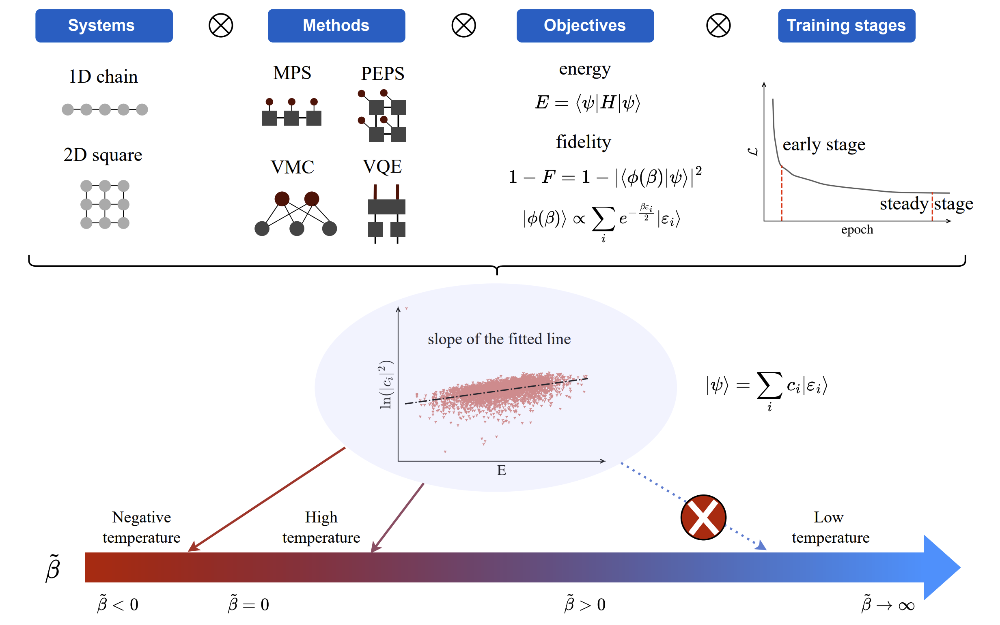

# Effective temperature in approximate quantum many-body states

This repository includes code implementation for [arXiv:2411.18921](https://arxiv.org/abs/2411.18921) based on the infrastructure enabled by [TensorCircuit-NG](https://github.com/tensorcircuit/tensorcircuit-ng).

